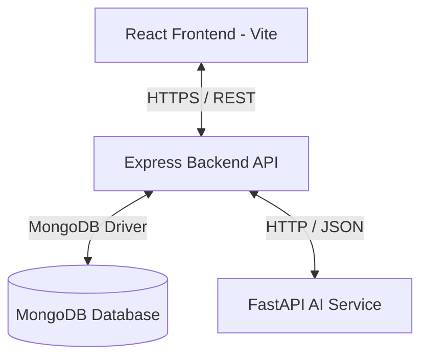

# System Architecture: SkillBridge

This document outlines the software architecture, design principles, and directory conventions for **SkillBridge**.

---

## 🏛️ System Overview

SkillBridge is built as a three-tier decoupled system designed for scalability, modularity, and high maintainability.



### 1. Presentation Layer (Frontend)

- **Technology:** React 19, Vite, TypeScript, Tailwind CSS v4.
- **Architectural Pattern:** Feature-First Architecture.
- **State Management:** Zustand for lightweight global state, TanStack Query for caching and server-state synchronization.
- **Core Principle:** Isolated features, clear component boundaries, minimal component re-renders.

### 2. Business Logic Layer (Backend API)

- **Technology:** Node.js, Express.js, TypeScript.
- **Architectural Pattern:** Layered (Controller-Service-Repository) Architecture.
- **Core Principle:** Separation of concerns. Controllers handle request/response formatting, Services handle business operations, Repositories handle database interactions, and Winston handles unified logging.

### 3. Intelligence Layer (AI Service)

- **Technology:** Python, FastAPI, Uvicorn, spaCy, scikit-learn.
- **Architectural Pattern:** Independent Service Architecture.
- **Core Principle:** Decoupled computing. Heavy operations (NLP processing, embedding generation, text parsing) are performed asynchronously in Python, keeping the Node.js API highly responsive.

---

## 📂 Folder Structures & Conventions

### Frontend (`frontend/src/`)

We employ a **Feature-First** structure. While generic configurations sit in core directories, feature-specific modules are grouped in `src/features/<feature-name>`.

```text
src/
├── app/          # App entry wrappers, providers, and route routing configs
├── assets/       # Static assets (images, icons)
├── components/   # Pure UI components (Buttons, Cards, Modals)
├── config/       # Environment & package initialization parameters
├── constants/    # Fixed data structures and configs
├── contexts/     # React state contexts (e.g. Theme, Authentication)
├── features/     # Feature-based folder architecture
│   └── resume/   # Example Feature Folder
│       ├── api/          # Feature API request handlers
│       ├── components/   # Feature-specific UI components
│       ├── hooks/        # Feature custom hooks
│       ├── store/        # Feature state (Zustand slice)
│       ├── types/        # Feature types
│       └── utils/        # Feature utilities
├── hooks/        # Global custom React hooks
├── layouts/      # Shell templates (SidebarLayout, CleanLayout)
├── lib/          # Custom third-party clients (axios, react-query)
├── providers/    # App context providers
├── routes/       # React Router path matching config
├── services/     # Cross-feature business services
├── shared/       # Reusable shared items
├── store/        # Core global Zustand store
├── styles/       # Tailwind directive and root CSS rules
├── theme/        # Theme configuration variables
├── types/        # Global TypeScript interfaces
└── utils/        # Global utility functions
```

### Backend (`backend/src/`)

We employ a **Layered Architecture** to segregate REST handling, business rules, database access, and configuration settings.

```text
src/
├── config/         # System environmental validations, loggers, db connection
├── controllers/    # Route controllers mapped to HTTP verbs
├── middlewares/    # Error middleware, request logger, cors, validation middlewares
├── models/         # Mongoose schema definitions (DB entities)
├── modules/        # Domain business packages
├── repositories/   # Data Access Layer (handles database queries)
├── routes/         # Router declarations with version nesting (/api/v1)
├── services/       # Core business logic processing
├── types/          # Express extensions, global type declarations
├── utils/          # Formatting tools and global scripts
└── validators/     # Request payload validation rules (Zod)
```

### AI Service (`ai/`)

FastAPI application structured for clean endpoint routing, configuration isolation, and model modularity.

```text
app/
├── core/           # Configuration parsing, logging, dependencies
├── config/         # App base settings (Pydantic Settings)
├── routers/        # FastAPI sub-routers (health, skills, analysis)
├── schemas/        # Request and response models (Pydantic)
├── services/       # Document parsers, embeddings processors, similarity logic
├── utils/          # General helper functions
└── main.py         # App entry and middleware configurations
```

---

## 🔒 Security & Data Flow Principles

1. **Authentication:** JWT tokens (implemented in later milestones).
2. **Environment Isolation:** Secrets and configurations are loaded strictly from `.env` files and validated at startup using **Zod** (Backend/Frontend) and **Pydantic** (AI Service).
3. **Data Integrity:** Strict input data validation on both frontend and backend using **Zod** and **Pydantic**.
4. **Resilience:** Express backend handles unhandled rejections, exceptions, and executes a **graceful shutdown** on receipt of SIGTERM/SIGINT, closing MongoDB client connection pools and HTTP listeners.
